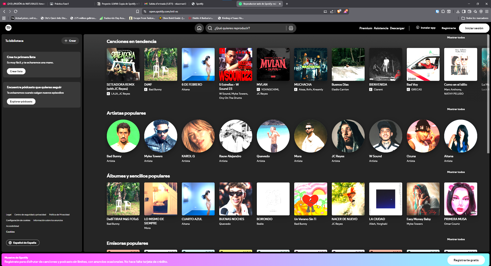
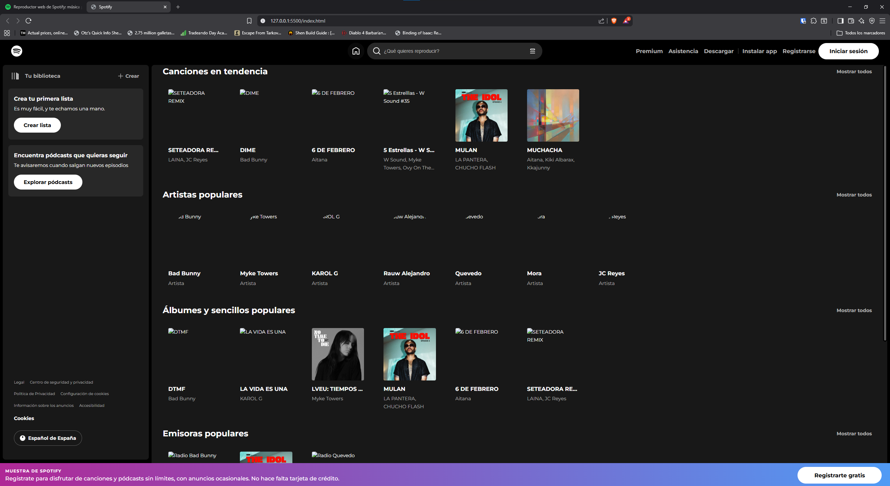
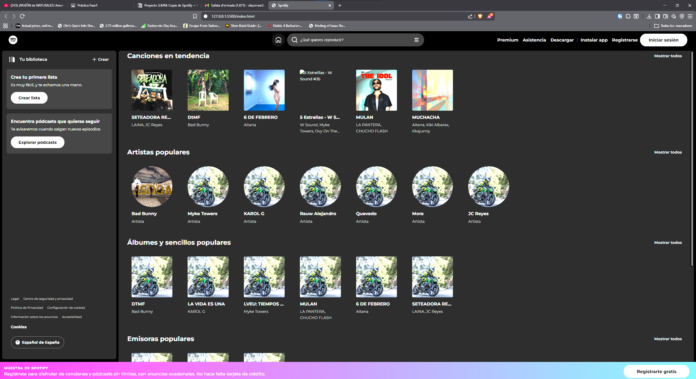
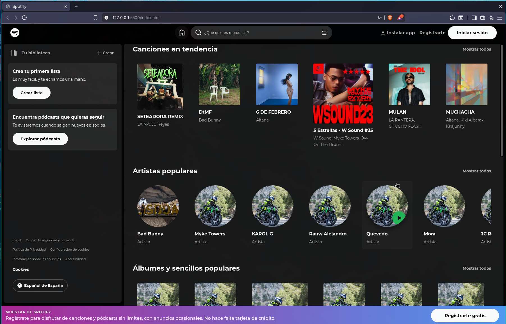
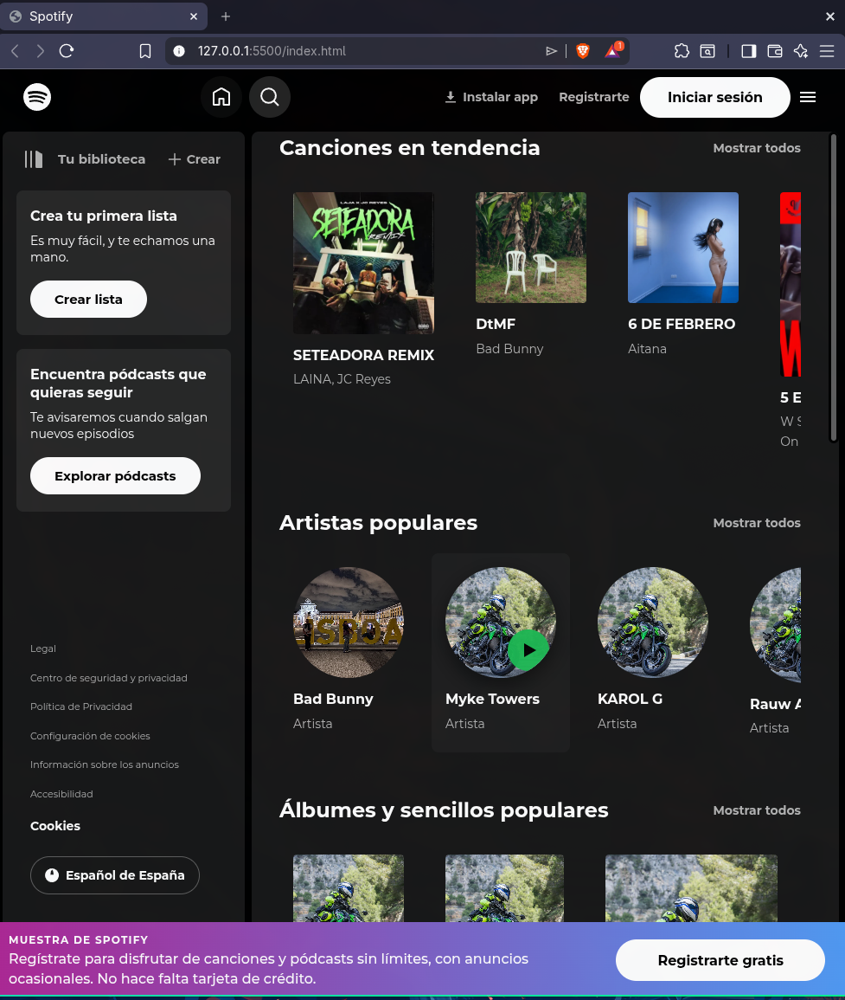
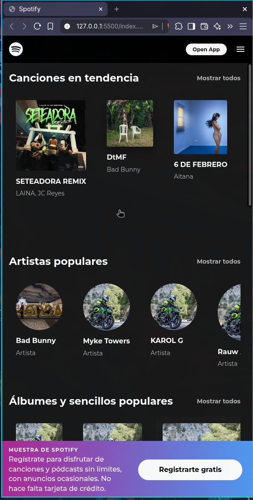
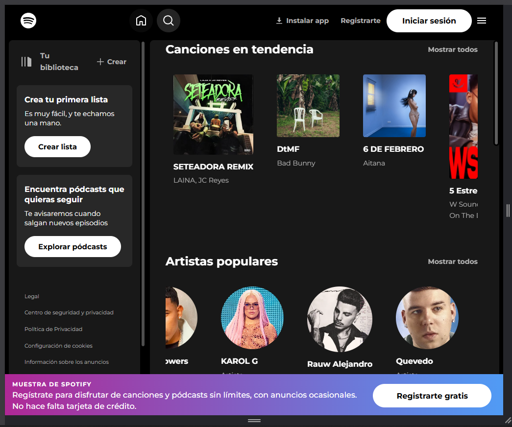
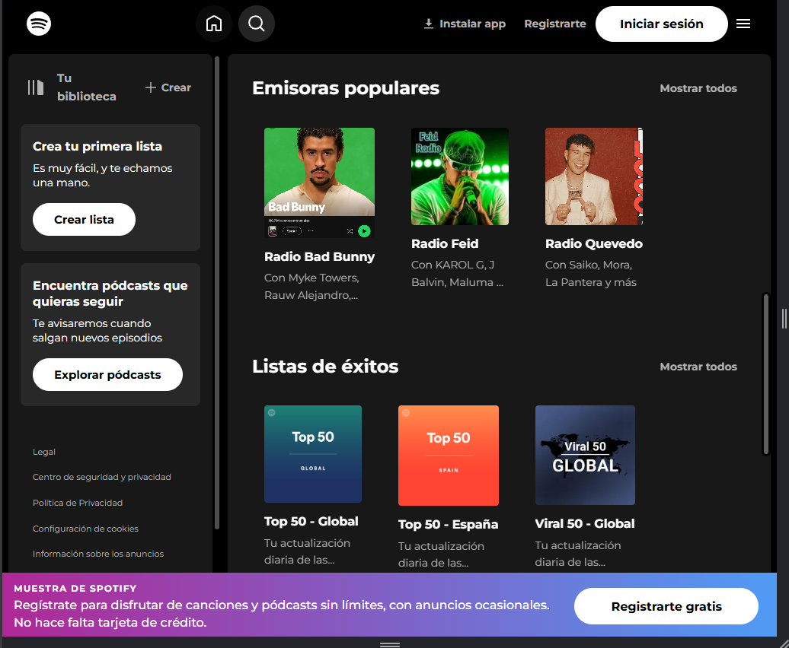
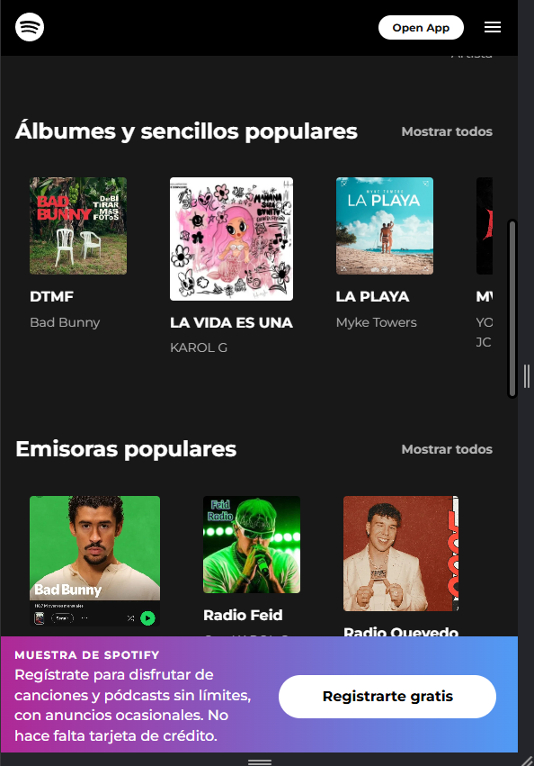

# Spotify FASE 1

## Resumen

**Objetivo:** Crear una réplica visual exacta de la página principal de Spotify. (Simplemente visual)

**Fecha:** 8/2/26 
**Fase actual:** FASE 1 - Desktop (Estática)

---

## Estructura Grid Principal

```
┌──────────────────────────────────────────────┐
│  Sidebar (280px)  │  Contenido Principal    │
│                   │                          │
│  ├─ Logo          │  ├─ Header              │
│  ├─ Navegación    │  ├─ Secciones (scroll)  │
│  ├─ Biblioteca    │  └─ Banner              │
│  └─ Legal         │                          │
└──────────────────────────────────────────────┘
```

---

## Secciones Implementadas

✅ **Sidebar de navegación**
- Logo Spotify
- Inicio / Buscar
- Tu biblioteca
- Enlaces legales
- Selector de idioma

✅ **Header**
- Navegación anterior/siguiente
- Barra de búsqueda
- Botones de usuario

✅ **Canciones en tendencia**

✅ **Artistas populares**

✅ **Álbumes y sencillos populares**

✅ **Emisoras Populares**

✅ **Listas de éxitos**

✅ **Banner de registro** 

---

## Colores Spotify

| Color | Hex | Uso |
|-------|-----|-----|
| Verde Spotify | #1db954 | Botón play, elementos activos |
| Negro | #121212 | Fondo principal |
| Negro oscuro | #000000 | Sidebar |
| Gris oscuro | #181818 | Contenido |
| Gris claro | #282828 | Tarjetas |
| Blanco | #ffffff | Texto principal |
| Gris | #b3b3b3 | Texto secundario |

---

## Capturas Web Original



---

## Capturas Fase 1





---

# Spotify FASE 2

## Resumen

**Objetivo:** Crear una réplica visual exacta de la página principal de Spotify. (Implementar Responsive en tablet y movil)

**Fecha:** 23/2/26 
**Fase actual:** FASE 2 - Mobile | Tablet (Responsive)









---



D



---




